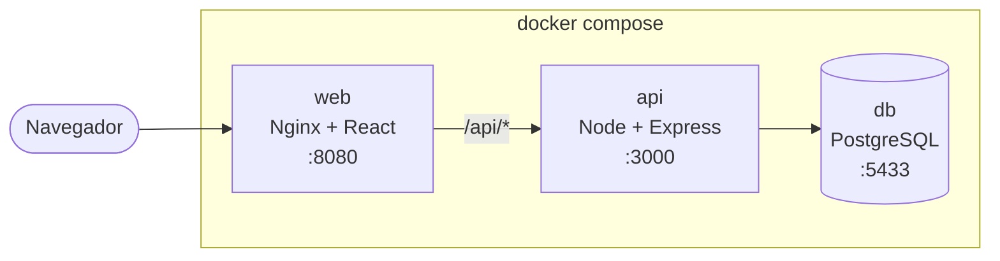
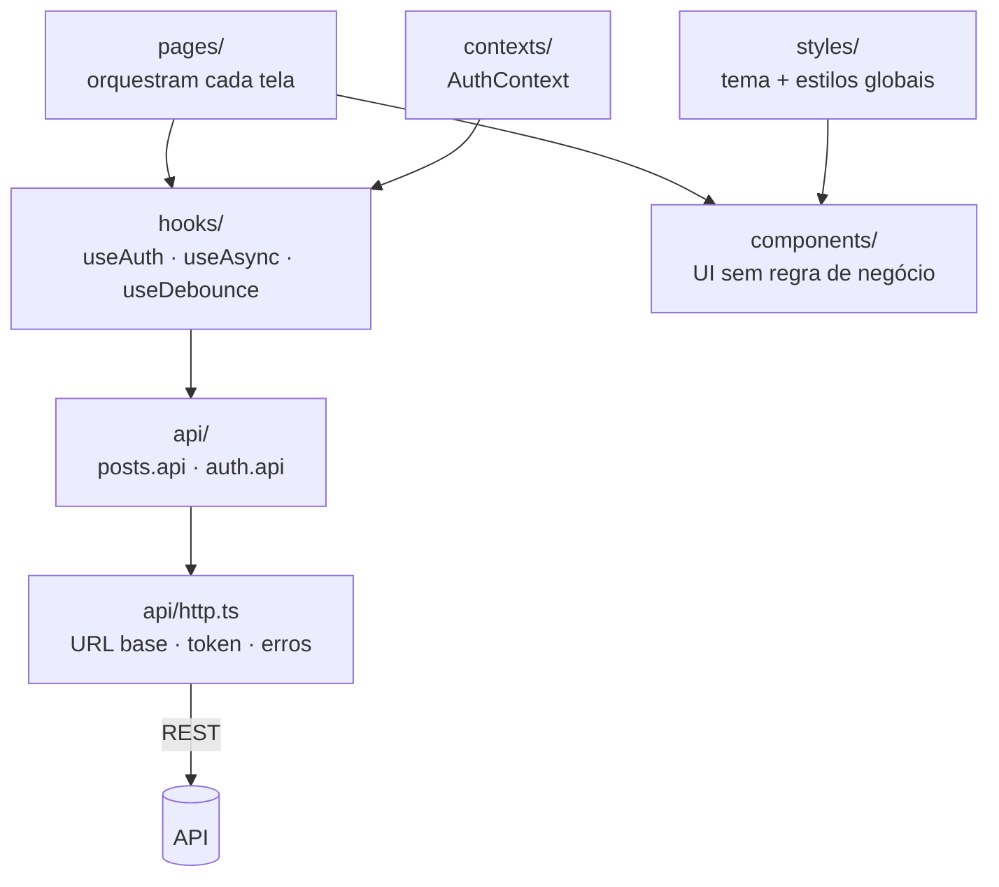
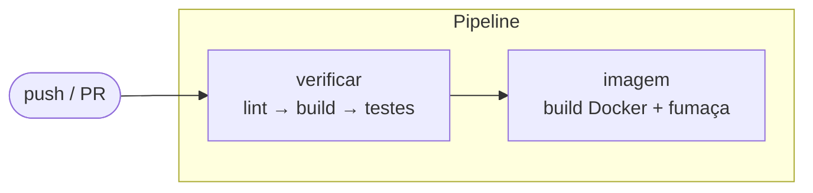

# Tech Challenge — Interface do Blog Acadêmico

Interface web de uma plataforma de blog acadêmico voltada a **professores(as) e alunos(as) da
rede pública de educação**. Este projeto é a **Fase 3** do Tech Challenge: o front-end em
**React + TypeScript** que consome a API REST construída na fase anterior.

> 🔗 **API (back-end):** [tech-challenge-blog-api](https://github.com/PedroHenriqueCostaRibeiro/tech-challenge-blog-api)

## Sumário

- [Arquitetura do sistema](#arquitetura-do-sistema)
- [Tecnologias](#tecnologias)
- [Como executar](#como-executar)
- [Variáveis de ambiente](#variáveis-de-ambiente)
- [Guia de uso](#guia-de-uso)
- [Testes e cobertura](#testes-e-cobertura)
- [CI/CD](#cicd)
- [Relato de experiências e desafios](#relato-de-experiências-e-desafios)
- [Próximos passos](#próximos-passos)

---

## Arquitetura do sistema

A aplicação inteira são três contêineres, e a interface conversa com a API por um proxy do
Nginx — nunca por CORS:



### Camadas do front-end



A regra de dependência, em uma frase: **componentes de UI não conhecem HTTP, e os serviços não
conhecem React.** Isso mantém cada peça testável isoladamente — um componente se testa com
props, um serviço com `fetch` simulado.

| Camada | Papel | Pasta |
| --- | --- | --- |
| **Páginas** | Orquestram cada tela e seus estados | `src/pages/` |
| **Componentes** | UI reutilizável, sem regra de negócio | `src/components/` |
| **Contextos** | Estado global — apenas a sessão | `src/contexts/` |
| **Hooks** | Lógica reutilizável de comportamento | `src/hooks/` |
| **API** | Todo acesso HTTP, em um ponto só | `src/api/` |
| **Estilos** | Tema tipado e estilos globais | `src/styles/` |
| **Utilitários** | Formatação de data e resumo | `src/utils/` |

### Estrutura de pastas

```
src/
├── api/
│   ├── http.ts            # cliente único: URL base, token, normalização de erro
│   ├── posts.api.ts       # os seis endpoints de post
│   ├── auth.api.ts        # login e reidratação de sessão
│   └── token.ts           # leitura/escrita do JWT, à prova de armazenamento bloqueado
├── components/
│   ├── ui/                # Alert, Button, ConfirmDialog, EmptyState, SearchInput,
│   │                      # Spinner, TextArea, TextField, VisuallyHidden
│   ├── layout/            # Container, Header, Layout, ProtectedRoute
│   ├── PostCard.tsx       # item da listagem
│   └── PostForm.tsx       # formulário compartilhado entre criar e editar
├── contexts/
│   ├── auth-context.ts    # o contexto em si (separado para o Fast Refresh funcionar)
│   └── AuthContext.tsx    # o provedor
├── hooks/
│   ├── useAuth.ts         # acesso à sessão
│   ├── useAsync.ts        # estados de carregando / sucesso / erro
│   └── useDebounce.ts     # evita uma requisição por tecla na busca
├── pages/                 # Home, PostDetail, Login, Admin, PostCreate, PostEdit, NotFound
├── routes/AppRoutes.tsx   # mapa de rotas e a guarda de autenticação
├── styles/                # theme.ts, global.ts, styled.d.ts
├── types/index.ts         # Post, User, LoginResponse
└── utils/format.ts        # data em pt-BR e resumo do conteúdo
```

### Mapa de rotas

| Rota | Tela | Acesso |
| --- | --- | --- |
| `/` | Listagem com busca | 🌐 Público |
| `/posts/:id` | Leitura da postagem | 🌐 Público |
| `/login` | Entrada de docentes | 🌐 Público |
| `/admin` | Administração das postagens | 🔒 Docente |
| `/admin/posts/new` | Criação | 🔒 Docente |
| `/admin/posts/:id/edit` | Edição | 🔒 Docente |
| `*` | Página não encontrada | 🌐 Público |

As rotas de docente ficam todas sob `/admin`, o que permite aplicar a guarda **uma vez** em vez
de repeti-la por página — menos superfície para esquecer de proteger uma rota nova.

> ⚠️ **A guarda de rotas é experiência de uso, não segurança.** O navegador está sob controle de
> quem o usa, e o DevTools contorna qualquer verificação no cliente. Quem de fato impede um
> `curl` direto é o middleware da API, que responde `401` mesmo que alguém chame o endpoint
> diretamente. A guarda existe para não mostrar ao usuário portas que ele não pode abrir.

---

## Tecnologias

- **React 19** + **TypeScript 6** — componentes funcionais e hooks
- **Vite 8** — build e servidor de desenvolvimento
- **Styled Components 6** — estilização com tema tipado
- **React Router 7** — roteamento no cliente
- **Vitest 5** + **Testing Library** — testes
- **Docker** / **Nginx** — containerização
- **GitHub Actions** — CI

---

## Como executar

### Opção A — Docker (recomendada)

Sobe a aplicação inteira: banco, API e interface.

**Pré-requisito:** os dois repositórios clonados **lado a lado**.

```
pasta-do-projeto/
├── tech-challenge-blog-api/
└── tech-challenge-blog-web/   ← rode o compose a partir daqui
```

Clonando:

```bash
git clone https://github.com/PedroHenriqueCostaRibeiro/tech-challenge-blog-api.git
```

```bash
git clone https://github.com/PedroHenriqueCostaRibeiro/tech-challenge-blog-web.git
```

Subindo:

```bash
cd tech-challenge-blog-web && docker compose up --build
```

Criando os docentes de demonstração — **sem eles não há como fazer login**:

```bash
docker compose exec api node dist/database/seed.js
```

Pronto:

| | |
| --- | --- |
| **Interface** | http://localhost:8080 |
| **API** | http://localhost:3000 |
| **Banco** | localhost:5433 |

Para parar: `Ctrl + C` ou `docker compose down`. Os dados ficam no volume e sobrevivem.

### Opção B — Local, sem Docker

Requer **Node.js 20+** e a API rodando em `http://localhost:3000`.

```bash
npm install
```

```bash
cp .env.example .env
```

```bash
npm run dev
```

A interface sobe em http://localhost:5173. O proxy do Vite repassa `/api` para a API, então não
há CORS envolvido.

### Publicando

O passo a passo do deploy no Render — banco, API e interface — está em
[`docs/deploy-render.md`](docs/deploy-render.md), com as armadilhas de cada etapa e um guia de
diagnóstico.

---

## Variáveis de ambiente

| Variável | Padrão | Descrição |
| --- | --- | --- |
| `VITE_API_URL` | `/api` | URL base da API |

> ⚠️ **Esta variável é congelada no build, não na execução.** O Vite substitui
> `import.meta.env.VITE_API_URL` pelo valor **durante a compilação**. Defini-la no `environment`
> de um contêiner ou no painel de um serviço em execução **não tem efeito nenhum** — o valor já
> está embutido no JavaScript gerado.
>
> No Docker ela entra como argumento de build:
>
> ```bash
> docker build --build-arg VITE_API_URL=https://sua-api.exemplo.com -t blog-web .
> ```

---

## Guia de uso

### Estudantes e visitantes — sem conta

A leitura é pública por decisão de produto.

1. Abra a interface: as postagens aparecem em cartões com **título, autor e um resumo**.
2. Use o campo de busca para filtrar por **título, autor ou palavra-chave**. A busca aguarda
   você parar de digitar antes de consultar o servidor.
3. Clique em uma postagem para ler o conteúdo completo.

### Docentes — com conta

1. Clique em **Entrar** e use uma credencial de demonstração:

   | E-mail | Senha |
   | --- | --- |
   | `maria@escola.edu.br` | `senha123` |
   | `joao@escola.edu.br` | `senha123` |

   > São credenciais de **demonstração**, para desenvolvimento e para o vídeo de apresentação.

2. Após entrar, você vai para **Administração**, com todas as postagens listadas.
3. **Nova postagem** abre o formulário. O campo de autor já vem preenchido com seu nome, mas
   continua editável.
4. **Editar** carrega os dados atuais da postagem no formulário.
5. **Excluir** pede confirmação nomeando a postagem, porque confirmar sem saber qual é o mesmo
   que apagar a coisa errada.
6. **Sair** encerra a sessão e leva de volta ao blog público.

A sessão dura 8 horas e **sobrevive a um recarregamento da página**.

---

## Testes e cobertura

```bash
npm test
```

```bash
npm run test:coverage
```

- **117 testes** em 14 arquivos
- Cobertura de **~96%**, com `api/`, `hooks/` e `contexts/` acima de 95%
- O `vite.config.ts` trava limites mínimos: se a cobertura cair, o comando — e o CI — falham

O que sempre tem teste, sem exceção:

| Comportamento | Por quê |
| --- | --- |
| Rotas protegidas bloqueiam sem sessão | É o requisito de autorização |
| A guarda **não** redireciona durante a verificação | Senão todo F5 expulsa quem está logado |
| Formulário vazio não chama a API | Evita requisição inútil e erro confuso |
| Erro do servidor não apaga o que foi digitado | Reescrever um post por erro de rede é inaceitável |
| `DELETE` sem corpo não quebra | A exclusão pareceria ter falhado |
| Busca descarta resposta atrasada | Digitação rápida mostraria o resultado errado |

---

## CI/CD

O workflow em `.github/workflows/main.yml` roda a cada `push` e `pull request` nas branches
`dev` e `main`:



- **`verificar`** — instala com `npm ci`, roda o lint, compila (incluindo checagem de tipos) e
  executa os testes com cobertura.
- **`imagem`** — constrói a imagem Docker e a sobe **sem a API ao lado**, exigindo `200` na home
  e em rotas profundas. Isso protege duas coisas ao mesmo tempo: o fallback de SPA e a
  resiliência da interface à ausência da API.

---

## Relato de experiências e desafios

Esta seção registra o que efetivamente deu trabalho. Vários itens abaixo **não apareceram em
testes** — apareceram quando fomos conferir no navegador ou no contêiner.

### O teste verde que mentia

Ao sair da conta a partir de `/admin`, o usuário caía na tela de login — como se precisasse
entrar de novo. Tentamos três correções no botão "Sair": inverter a ordem entre navegar e
encerrar a sessão (o React agrupa as duas atualizações e a guarda decide primeiro), `flushSync`
(o React Router despacha a navegação dentro de uma transição) e adiar o encerramento com
`setTimeout`.

**A terceira passou nos testes — e o navegador continuava indo para o login.** O jsdom com
`MemoryRouter` tem comportamento de tempo diferente do `BrowserRouter` real, então a suíte ficou
verde sobre algo que não existia.

Foi a lição mais cara da fase: **um teste verde não é prova, é indício.** A solução final não
depende de tempo — a guarda distingue "saiu da conta" (vai para a home) de "nunca teve conta"
(vai para o login), e foi verificada nos dois ambientes.

### O Nginx que morria junto com a API

O CI reprovou o build da imagem. Reproduzindo localmente, o contêiner nem subia:

```
[emerg] host not found in upstream "api"
```

O Nginx resolve o nome do upstream **na inicialização** e se recusa a subir se ele não existir.
Ou seja: a interface morria sempre que a API estivesse fora — o inverso do desejado, já que a
leitura do blog é pública e deveria continuar servindo.

No `docker compose` funcionava **por acidente**, porque o serviço da API sempre subia antes. Só
um cenário diferente — o do CI — expôs a fragilidade. A correção usa variável no `proxy_pass`,
o que adia a resolução para o momento da requisição.

### Variáveis que não são lidas quando você espera

`import.meta.env.VITE_API_URL` **não é lido em tempo de execução**: o Vite substitui o texto
durante a compilação. Declará-la no `environment` de um contêiner não tem efeito algum — e o
sintoma só aparece em produção, quando o front tenta chamar um endereço que não existe.

Por isso ela entra como argumento de build. Conferimos no pacote servido pelo contêiner que a
URL aparece como literal e que não sobrou nenhuma ocorrência de `import.meta.env`.

### O F5 que quebrava a aplicação

Com roteamento no cliente, `/posts/abc-123` só existe dentro do JavaScript. Ao recarregar nesse
endereço, o navegador pede o arquivo `posts/abc-123` ao servidor, que não existe — e responde
`404` mesmo com a aplicação perfeita.

Uma linha de `try_files` no Nginx resolve. Sem ela, **todo link compartilhado quebraria**. Hoje
o CI verifica isso a cada execução.

### Um 500 que deveria ser 404

Abrindo `/posts/id-invalido`, a tela mostrava "Erro interno do servidor". O log do contêiner
apontou a causa: a coluna `id` é do tipo `uuid` no PostgreSQL, e comparar com uma string
malformada faz o próprio banco lançar uma exceção.

Um UUID válido e inexistente já respondia `404` corretamente — o problema era só o formato. Um
id truncado num link compartilhado mostrava uma mensagem alarmante e falsa.

Curiosamente, os testes existentes **mascaravam o defeito**: usavam ids fictícios como `"uuid-1"`,
que jamais existiriam numa coluna `uuid`. Passaram a usar UUIDs válidos.

### O termômetro quebrado

O contêiner da interface aparecia como `unhealthy` enquanto servia tudo normalmente. O Nginx
escuta apenas em IPv4, mas `localhost` dentro do contêiner resolve também para `::1`, e o `wget`
do Alpine tenta o IPv6 primeiro.

Não era cosmético: um orquestrador reiniciaria o contêiner em laço achando que há defeito.
Trocar `localhost` por `127.0.0.1` resolveu. Vale notar que o mesmo **não** acontecia com a API,
que escuta em dual-stack — conferir antes de assumir evitou uma correção errada.

### O que o jsdom não vê

Duas verificações não cabem na suíte automatizada, e foi mais honesto assumir isso do que fingir
cobertura:

- **`createGlobalStyle` não injeta folha de estilo no jsdom.** Estilos globais são validados no
  navegador; estilos de componente continuam testáveis normalmente.
- **Alvos de toque dependem de layout calculado**, que o jsdom não produz. Foi assim que
  descobrimos, no navegador, dois links de navegação com menos de 44px.

### Acentos destruídos antes de chegarem ao banco

Durante os testes manuais, os títulos apareciam como "Fotoss�ntese". Investigando os bytes, o
banco continha o caractere de substituição `U+FFFD` — ou seja, os acentos já chegavam
destruídos, mangidos pelo shell do Windows nos comandos de inserção.

**Não era defeito da aplicação**, e o cabeçalho renderizado a partir do código-fonte provava
isso. Inserindo por outro caminho, o texto voltou idêntico ao enviado.

### Balanço

O padrão que se repetiu: **o que passa no teste nem sempre passa na realidade, e o que falha na
realidade nem sempre é bug do código.** Cada item acima veio de olhar o sistema rodando — no
navegador, no contêiner, nos bytes do banco — em vez de confiar apenas na suíte.

---

## Próximos passos

- Publicar a aplicação e validar o fluxo completo no ambiente hospedado
- Comentários nas postagens (opcional no desafio, deixado de fora por escopo)
- Paginação na listagem, quando o volume de postagens justificar
- Auditoria com Lighthouse e validação da ativação por teclado com leitor de tela real
